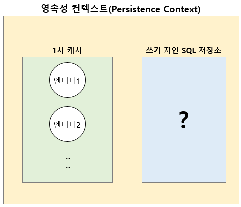

# JPA 영속성 컨텍스트의 이점(5가지)을 설명해주세요.

영속성 컨텍스트는 엔티티를 영구 저장하는 환경을 의미한다.

## 영속성 상태의 장점
1차 캐시, 동일성 보장, 쓰기 지연, 변경 감지, 지연 로딩 등이 존재한다.

## 영속성 컨텍스트(Persistence Context)

### 1. 1차 캐시 
DB 접근 없이 조회가 가능하며 1차 캐시에 없으면 DB 에서 조회에 1차 캐시에 올려 놓는다.

### 2. 동일성 보장 
동일성 비교가 가능(==) <- 1차 캐시에 의해 가능

```java
      public class JpaMain {
        public static void main(String[] args) {
          EntityManagerFactory emf = Persistence.createEntityManagerFactory("hello");

          EntityManager em = emf.createEntityManager();
          EntityTransaction tx = em.getTransaction();
          tx.begin();

          // code
          Member findMember1 = em.find(Member.class, 101L);
          Member findMember2 = em.find(Member.class, 101L);

          System.out.println("result = " + (findMember1 == findMember2));

          tx.commit();
          em.close();
          emf.close();
        }
      }
```

### 3. 트랜잭션을 지원하는 쓰기 지연 
영속성 컨텍스트에 변경이 발생했을 때, 바로 데이터베이스로 쿼리를 보내지 않고 SQL 쿼리를 버퍼에 모아놨다가, 영속성 컨텍스트가 flush 하는 시점에 모아둔 SQL 쿼리를 데이터베이스로 보내는 기능

* persist() 를 실행할 때에는, 영속 컨텍스트의 1차캐시에 member 엔티티가 저장되고 쓰기 지연 SQL 저장소에는 member 엔티티의 INSERT SQL 쿼리문이 저장된다.
* tx.commit() 즉 트랜잭션을 커밋 하는 순간 쓰기지연 SQL 저장소에 저장된 INSERT SQL 를 보내 데이터베이스에 저장한다.
> 여러개 엔티티 생성 후 persist 하더라도 commit 하기 전에는 데이터베이스에 저장되지 않는다. - 쓰기지연


### 4. 변경 감지(Dirty Checking) 
> JPA 는 트랜잭션 커밋 시점에 내부적으로 flush 한다. 그 다음 엔티티와 스냅샷을 비교한다.
> * 스냅샷
>   * 1차 캐시안에는 @Id, Entity, 스냅샷이 있다.
>   * 최초로 영속성 컨텍스트에 들어왔을 때 JPA 가 스냅샷을 뜬다.
* 영속 컨텍스트의 1차 캐시에는 초기의 member 데이터가 저장되어 있을 것이다.
* 이후 set 메서드를 통해 데이터를 변경한다.
* 트랜잭션 커밋 시 flush 가 발생하면서 1차 캐시에서 엔티티와 스냅샷을 비교하여 변경에 대한 감지를 한다.
* SQL UPDATE 쿼리 생성해 쓰기 지연 SQL 저장소에서 쿼리를 보낸다. -> DB 에 저장된 데이터 수정 완료

#### flush() 발생 시
* 트랜잭션 커밋 시 변경 내용을 데이터베이스에 반영한다.
* 트랜잭션 커밋이 일어날 때마다 플러시도 함께 발생해 데이터베이스에 반영한다.
* 쓰기 지연 SQL 저장소의 쿼리를 데이터베이스에 전송한다(등록, 수정, 삭제 쿼리)

#### 영속성 컨텍스트 플러시 하는 법
* em.flush() 직접호출
* tx.commit 트랜잭션 커밋을 통한 자동 호출
* JPQL 쿼리 실행 - 플러시 자동 호출

#### flush() 주의점
* flush() 는 영속성 컨텍스트를 비우지 않는다.
* 영속성 컨텍스트의 변경 내용을 데이터베이스에 동기화하는 역할이다.
* 플러시는 트랜잭션에서 중요 -> 커밋 직전에 동기화하면 된다.

#### 더티 체킹과 readOnly=true 관계
* Transactional의 옵션 readOnly = true로 설정하면
  Spring Framework는 JPA의 Session-Flush Mode를 MANUAL 로 설정함.
* MAUNUAL 모드는,
  트랜잭션 내에서 사용자가 수동으로 flush를 호출하지 않으면
  flush가 자동으로 수행되지 않는 모드이다.
  * 트랜잭션 커밋 시 자동으로 영속성 컨텍스트가 flush 되지 않으니 조회용으로 가져온 엔티티의 의도치 않은 수정을 막을 수 있다.
  * JPA 는 해당 트랜잭션 내에서 조회하는 엔티티는 조회용임을 인식하고 변경 감지를 위하 스냅샷도 따로 보관하지 않는다 - 메모리 절약
### 5. 지연로딩
엔티티에서 해당 엔티티를 불러올 때, 그 때 SQL 을 날려 해당 데이터를 가져온다.

* 즉시 로딩(EAGER) : @xxToxx(fetch = fetchType.EAGER)
```java
  @Entity
  public class Member {
      @Id @GeneratedValue
      private Long id;
      private String username;
  
      @ManyToOne(fetch = FetchType.EAGER) //Team을 조회할 때 즉시로딩을 사용하곘다!
      @JoinColumn(name = "team_id")
      Team team;
  }
  @Entity
  public class Team {
  
      @Id @GeneratedValue
      private Long id;
      private String teamname;
  }
```

[조회]

  ```Member findMember = em.createQuery("select m from Member m", Member.class).getSingleResult();```

[결과]
```sql
//멤버를 조회하는 쿼리
select
    member0_.id as id1_0_,
    member0_.team_id as team_id3_0_,
    member0_.username as username2_0_ 
from
    Member member0_

//팀을 조회하는 쿼리
select
    team0_.id as id1_3_0_,
    team0_.name as name2_3_0_ 
from
    Team team0_ 
where
    team0_.id=?
```
: 즉시 로딩(EAGER) 방식을 사용하면 Member를 조회하는 시점에 바로 Team까지 불러오는 쿼리를 날려 한꺼번에 데이터를 불러온다. (1+N 문제)

* 지연 로딩(LAZY) : @xxToxx(fetch = fetchType.LAZY)
```java
  @Entity
  public class Member {
      @Id @GeneratedValue
      private Long id;
      private String username;

      @ManyToOne(fetch = FetchType.LAZY) //Team을 조회할 때 지연로딩을 사용하곘다!
      @JoinColumn(name = "team_id")
      Team team;
  }
  @Entity
  public class Team {
  
      @Id @GeneratedValue
      private Long id;
      private String teamname;
  }
```

[조회]

```Member findMember = em.createQuery("select m from Member m", Member.class).getSingleResult();```

[결과]
```sql
//Team을 조회하는 쿼리가 나가지 않음!
select
    member0_.id as id1_0_,
    member0_.team_id as team_id3_0_,
    member0_.username as username2_0_ 
from
    Member member0_

```
: 지연 로딩을 사용하면 Member를 조회하는 시점이 아닌 실제 Team을 사용하는 시점에 쿼리가 나가도록 할 수 있다는 장점이 있다.

> @ManyToOne, @OneToOne 은 기본이 즉시로딩이므로 지연 로딩으로 바꾸자, 나머지는 기본이 지연로딩임
