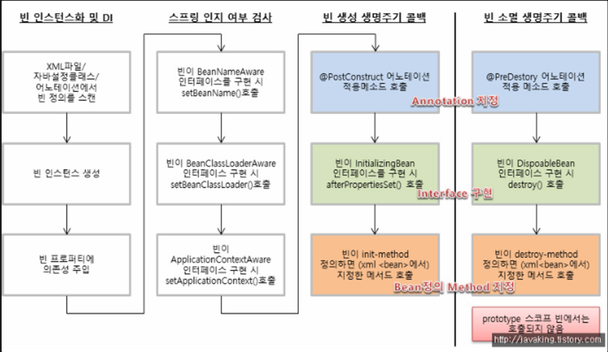

# 스프링 Bean의 생성과정에 대해 말씀해주세요.

### Spring Bean

- Spring IoC Container가 관리하는 자바 객체, 컨테이너에 의해 생명주기가 관리된다. ( Inversion Of Control )

- Application에서 필요한 순간에 Bean을 IoC Container에서 가져옴.

### Spring Bean 등록 방법

- @Bean 어노테이션 / @Component 어노테이션을 사용하거나, XML과 같은 설정을 통해 일반 객체를 Bean 으로 등록 가능하다.

### 1. Bean 등록 방법 - 컴포넌트 스캔

- `@Component`
    - 클래스 레벨에 적용
    - IoC Container가 생성될 때, 컴포넌트 스캔을 통해 자동으로 빈에 등록 가능
    - @Controller, @Service, @Repository 등의 어노테이션 내부에 @Component 가 선언되어 있어, 컴포넌트 스캔을 통한 Bean 등록이 가능하다.
    - 이 때, Bean 으로 등록된 모든 클래스의 객체들은 싱글톤으로 생성된다.

### 2. Bean 등록 방법 - 직접 등록

- Configuration을 위한 클래스를 하나 만든 후, 해당 클래스를 `**@Configuration**` 으로 명시한다.
- Bean으로 등록할 클래스를 `**@Bean**` 메소드로 생성하여, 객체를 리턴하도록 한다.
- 간단하게 인터페이스에 대한 구현체를 바꿀 수 있다. :
  인터페이스로 구현된 어떤 클래스의 구현체가 바뀌면, 해당 클래스가 속한 Configuration을 찾아 리턴 클래스 객체만 수정해주면 된다.

### 의존 관계 설정

- 자동 의존관계
- 수동 의존관계

### 의존 관계 설정 - 자동 의존 관계

- 컴포넌트 스캔을 이용하여 스프링 빈을 등록하였으면, 클래스의 생성자에 `**@Autowired**` 어노테이션을 명시해주면 됨. ( = 생성자 주입 방식 DI )

### 의존 관계 설정 - 수동 의존 관계

- @Component 어노테이션이 아니라, Configuration 을 통해 직접 Bean을 등록한 경우, 새롭게 추가할 것이 없음.
- 실제 클래스의 구현된 생성자의 형태와 동일하게, Configuration에서도 객체를 리턴해주면 됨.

---

즉,
Bean의 등록은 @Component를 통한 컴포넌트 스캔 & @Configuration + @Bean 을 통해 진행 가능하고 + XML 파일 기반 설정을 통해 Bean 등록도 가능하다. ( ⇒ 이후 ApplicationContext가 Reflection API를 활용해 Bean을 생성한다. )

이렇게 등록되어 생성된 Bean의
의존관계는 @Autowired, @Configuration + @Bean 을 통해 설정해줄 수 있다.

---

### Spring Bean의 생성주기

- 스프링 컨테이너 생성 → 빈(객체) 생성 → 의존 설정(주입) → 초기화 콜백 → 사용 → 소멸전 콜백 → 소멸
  순서의 Life Cycle 을 가진다.
- Spring Container가 초기화될 때, 먼저 Bean 객체를 설정 정보에 맞추어 생성하고, 의존 관계를 설정한 뒤에 해당 프로세스가 완료되면 **Bean 객체가 지정한 메소드를 호출하여 초기화**한다.
- 객체 사용 이후, 컨테이너가 종료될 때 Bean이 지정한 메소드를 호출해 소멸 과정을 진행한다.
- Spring은 객체의 생성 / 소멸과 관련한 두가지 인터페이스를 제공한다.
- 각각 `**InitializingBean**`, `**DisposableBean**` 인터페이스이다.
- Bean 객체의 클래스가 `**InitializingBean**` / `**DisposableBean**` 을 구현하고 있으면, 해당 인터페이스에 정의된 메서드를 호출하여 빈 객체의 초기화 및 종료를 진행할 수 있도록 한다.


```java
public interface InitializingBean {
void afterPropertiesSet() throws Exception;
}

public interface DisposableBean {
void destroy() throws Exception;
}
```

```java
public class SampleBean implements InitializingBean, DisposableBean {

		@Override
		public void afterPropertiesSet() throws Exception {
				// 빈 생성 후 메소드 호출
				System.out.println("SampleBean.afterPropertiesSet() 실행");
		}

		@Override
		public void destroy() throws Exception {
				// 소멸을 진행하는 메소드
				System.out.println("SampleBean.destroy() 실행");
		}
}
```
