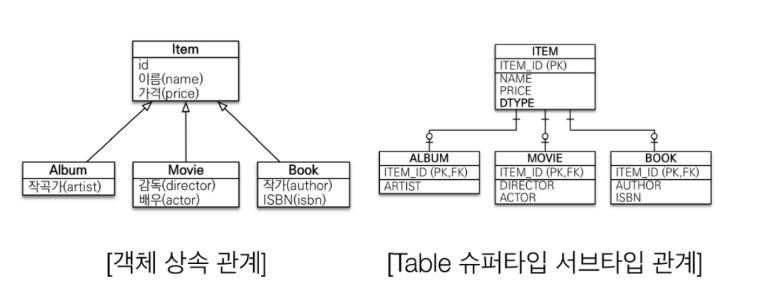

## JPA를 쓴다면 그 이유에 대해서 설명해주세요.

---

### 1. JPA란?
- 자바에서 사용하는 ORM(Object-Relational-Mapping/객체 관계 매핑) 기술 표준
- 구현된 클래스와 매핑을 해주기 위해 사용되는 프레임워크
- ex) Hibernate

### 2. 동작 방식
자바 인터페이스로 정의되어 자바 애플리케이션과 JDBC 사이에서 동작한다.
JPA를 사용하면 JPA 내부에서 JDBC API를 사용하여 SQL을 호출해서 DB와 통신한다.

### 3. 사용하는 이유?
과거에는 SQL 중심의 개발을 했지만, JPA를 사용하면 객체 중심적인 개발이 가능하다

1. 생산성 (CRUD)
   - JDBC 방식의 경우 SQL 쿼리문을 직접 작성해야 데이터베이스에 접근
   - 하지만, JPA는 별도의 쿼리문 작성이 필요없이 DDL문을 자동 생성
   - 저장:jpa.persist(member), 조회:jpa.find(memberId), 수정:member.setName("이름"), 삭제:jpa.remove(member)

2. 유지보수
   - 엔티티 클래스의 필드가 변경될 경우, 기존과 달리 필드만 추가하면 SQL문이 자동으로 처리된다
   
3. 패러다임 불일치 문제 해결
   - 상속/연관관계/객체 그래프 탐색/비교하기와 같은 패러다임 불일치를 해결
   - JAVA의 존재하는 상속관계를 객체의 상속관계를 지원하지 않는 데이터베이스에서 JPA는 해결이 가능
   - 