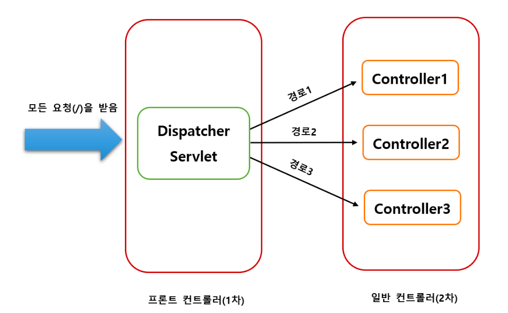

## Spring Web MVC의 Dispatcher Servlet의 동작 원리에 대해서 간단히 설명해주세요.

---

### 1. MVC에서의 역할
- 클라이언트로부터 받은 요청을 가장 먼저 받는 요소
- 프론트 컨트롤러의 역할 : 서블릿 컨테이너의 제일 앞에서 서버로 들어오는 클라이언트의 모든 요청을 받아서 처리하는 컨트롤러
- 공통적인 작업을 우선적으로 함수 처리한 후에 해당 요청을 처리해야 하는 컨트롤러를 찾아서 작업을 위임
- 

### 2. 동작 원리/흐름
- spring boot 구동시 `디스패쳐 서블릿`을 서블릿으로 자동 등록하고, 모든 경로 `/`에 대해 매핑
```
  1. 클라이언트에서 요청을 보내면, 디스패처 서블릿이 이를 받는다
  2. Handler Mapping을 통해 요청에 해당하는 `컨트롤러`를 찾는다 
  3. 요청에 해당하는 컨트롤러를 `Handler Adapter`를 찾아 객체의 메서드를 호출
  4. 핸들러 어댑터가 컨트롤러로 요청을 위임
  5. 컨트롤러가 요청을 처리한 뒤, 그 결과와 해당 View의 정보를 다시 DPS에 전달
  6. 받은 정보로 DPS는 View Resolver를 통해 View 파일 탐색
  7. 응답이 화면이라면 View의 이름에 맞는 View를 찾아서 반환해주는 뷰 리졸버가 적절한 화면을 제시
```
  
* [참고 출처](https://velog.io/@uiurihappy/%EB%94%94%EC%8A%A4%ED%8C%A8%EC%B2%98-%EC%84%9C%EB%B8%94%EB%A6%BFDispatcher-Servlet)