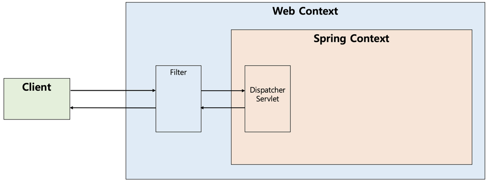
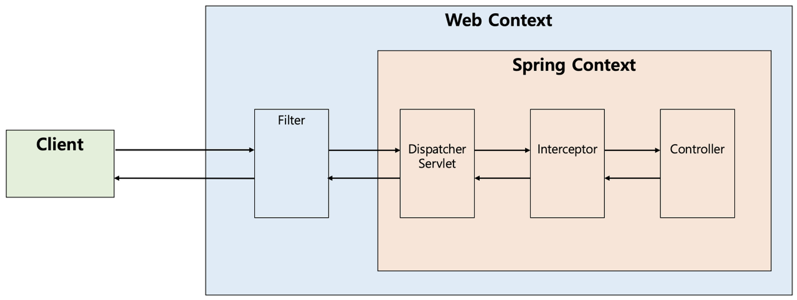

## Servlet Filter와 Spring Interceptor의 차이는 무엇인가요?

---

### 1. 개념의 배경
web에서 클라이언트의 요청 전 공통적으로 처리해야 하는 관심사가 있는데,
이 때 filter/interceptor/AOP를 사용한다.

### 2. 서블릿 필터?
- 디스패처 서블릿에 요청이 전달되기 전 / 후에 url 패턴에 맞는 모든 요청에 대해 부가 작업을 처리할 수 있는 기능을 제공
- 스프링의 범위 밖에 존재
- 주로 @Webfilter 어노테이션 사용
- 

### 3. 서블릿 인터셉터
- 스프링이 제공하는 기술
- 디스패처 서블릿이 컨트롤러를 호출하기 전/후에 요청을 가로채서 응답을 참조 혹은 가공
- 필터와 다르게 스프링 컨텍스트 내부에 존재
- 

### 4. 무엇이 다른가?
- 필터는 Request와 Response를 원하는 것으로 조작할 수 있지만, 인터셉터는 조작 불가
- 필터는 스프링과 무관한 전역적인 작업을 처리, 이미지나 데이터의 압축/문자열 인코딩 같은
  웹 어플리케이션이 전반적으로 사용되는 기능 구현에 적당
- 인터셉터는 클라이언트의 요청과 관련되어 전역적으로 처리해야 하는 작업을 수행, API 호출에 대한 로깅 또는 감사,
  컨트롤러로 넘겨주는 정보에 대한 가공을 수행하기에 적당

* [참고 사이트](https://dev-coco.tistory.com/173)