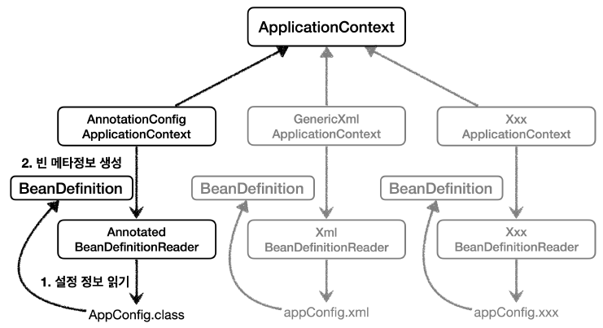

#  Spring Bean이란 무엇인가요?

> **목차**
>
>[🌿Spring Bean이란?](#-spring-bean이란)   
>[🌿Bean 정의](#-bean-정의)
>- BeanDefinition
>- BeanDefinition 내용
>
>[🌿Bean 명명](#-bean-명명)  
>[🌿Bean 인스턴스화](#-bean-인스턴스화)  
>💡Bean 런타임 타입 결정?

 

### 🌿 Spring Bean이란?

**Spring IoC 컨테이너에 의해 관리되는 객체**
Spring 애플리케이션의 핵심 구성 요소로서, Spring 컨테이너에 의해 생성, 조립 및 관리되는 객체.
> **Bean 사용 이유**  
> 컨테이너는 생명주기에 따라 Bean을 관리해줌  
> → application으로 요청이 올 때마다 객체가 생성되는 것이 아니고, 초기화 과정에서 생성된 Bean객체를 활용하기 때문에 성능상의 이점이 있음. 또한 의존성 관리와 java 객체의 생명주기 관리에도 용이.

컨테이너는 구성 메타데이터에 따라 Bean을 생성하는데,
컨테이너 내에서 이러한 빈 정의는 BeanDefinition 객체로 표현됨.

🔗 Java Bean이란?

 

### 🌿 Bean 정의

**BeanDefinition**

- BeanDefinitionReader 인터페이스:
    -   최상위 인터페이스
    -   `loadBeanDefinitions`메서드: 구성 메타데이터를 읽고 `BeanDefinition`을 생성하는 역할
- AbstractBeanDefinitionReader 클래스:
    -   `BeanDefinitionReader` 인터페이스를 구현한 추상 클래스(기본적인 구현)
    -   `loadBeanDefinitions` 메서드의 일부 로직을 구현하고, 구체적인 구현체들에게 나머지 로직을 위임
- XmlBeanDefinitionReader 클래스(AnnotatedBeanDefinitionReader 등):
    -   `AbstractBeanDefinitionReader`를 상속받아서 특정 형식의 구성 메타데이터를 읽는 구현체
    -   `loadBeanDefinitions` 메서드에서 구성 파일을 읽고, 각 Bean의 정보를 추출하여 `BeanDefinition`을 생성
    1.  구성 파일(XML, Java 등)을 읽어 `BeanDefinition`을 생성하는데 필요한 메타데이터를 추출
    2.  `BeanDefinitionRegistry`를 통해 각 Bean의 메타데이터를 등록.
        (`BeanDefinitionRegistry`는 Bean의 메타데이터를 저장하고, 스프링 컨테이너에 등록하는 인터페이스)

이러한 구조를 통해 스프링은 다양한 형식의 구성 메타데이터를 읽고 `BeanDefinition`을 생성할 수 있음.  `BeanDefinition`이 담고 있는 구성 정보에 따라, 스프링 컨테이너는 Bean을 생성하고 관리함.
(추상화를 통해 사용자는 구체적인 구현체를 교체하거나 확장하여 자신만의 구성 메타데이터 reader를 만들 수 있음)

이외에도 ApplicationContext 구현체들은 컨테이너 외부(사용자에 의해)에서 생성된 기존 객체들을 등록할 수 있음. (BeanFactory의 getBeanFactory() 메서드를 통해)

 

🔗 내부 빈(inner beans) 사용 및 자동와이어링(collaborators)과 관련 문제

 

**BeanDefinition 내용**

`@Bean` , `<bean>` 당 각각 하나씩 메타 정보가 생성되어, 이를 기반으로 Bean이 생성됨
-  패키지 지정 클래스 이름:
   일반적으로 정의되는 Bean의 실제 구현 클래스
-  Bean 동작 구성 요소:
   Bean이 컨테이너에서 어떻게 동작해야 하는지를 나타냄 (범위, 라이프사이클 콜백 등)
-  Bean이 작업을 수행하는 데 필요한 다른 Bean에 대한 참조
   =협력자(collaborator), 의존성(dependency)
-  새롭게 생성된 객체에 설정해야 하는 기타 구성 설정

이 메타데이터는 각 빈 정의를 구성하는 속성 집합으로 변환됨
| 속성 | 설명 |
|:--:|--|
| Class |  |
| Name  |  |
| Scope | 기본값: 싱글톤 |
| Constructor arguments | DI에서 사용(팩토리 역할의 Bean 사용시 없음) |
| Properties | DI에서 사용(팩토리 역할의 Bean 사용시 없음) |
| Autowiring mode | autowireMode, autowireCandidate |
| Lazy initialization | lazyInit 실제 사용하는 시점에 Bean 초기화 여부 |
| Initialization method | InitMethodName: Bean을 생성하고, DI 후에 호출되는 초기화 메서드|
| Destruction method | DestroyMethodName: Bean의 생명주기가 끝나서 제거하기 직전에 호출되는 메서드|

정의된 Bean은 Spring 컨테이너에 의해 필요한 곳에서 주입되어 사용됨

 

### 🌿 Bean 명명
Bean 이름은 기본적으로 메서드이름을 사용. 직접 부여도 가능 `@Bean(name="memberService2")`
소문자로 시작, 카멜 케이스 사용

때로는 단일 빈에 여러 개의 이름을 부여하는 것이 바람직할 수 있음(대규모 시스템에서 구성이 각 서브시스템 사이에 분할되어 있고 각 서브시스템이 자체의 객체 정의 세트를 가지는 경우)
이 때, 별칭(Bean aliasing)을 설정하여 사용함. @Bean 어노테이션의 name 속성은 이러한 목적으로 String 배열을 받을 수 있음  `@Bean({"dataSource", "subsystemA-dataSource", "subsystemB-dataSource"})`

이름 중복 시 오류 발생하므로 항상 다른 이름을 부여해야 함!

 

### 🌿 Bean 인스턴스화

-   **생성자 방식(Instantiation with a Constructor):**
    -   **when:**
        -   Bean이 간단하고 복잡한 초기화 로직이 필요하지 않은 경우.(일반적)
    -   **장점:** 간단하고 직관적인 방법으로 Bean을 생성 가능
    -    일부 경우에는 기본 생성자가 필요할 수 있음( )
-   **정적 팩토리 메서드 방식(Instantiation with a Static Factory Method):**
    -   **when:**
        -   객체 생성 로직을 유연하게 제어하고자 할 때.
            (ex. 다양한 생성 옵션에 따라 다른 하위 타입의 객체를 생성할 때)
        -   객체 생성에 필요한 복잡한 로직이 있을 때.
    -   **장점:** 객체 생성에 대한 유연성이 높아짐.
-   **인스턴스 팩토리 메서드 방식 (Instantiation by Using an Instance Factory Method):**
    -   **when:**
        -   다른 빈의 인스턴스 메서드를 통해 Bean을 생성하고자 할 때.
            (ex. DI를 통해 동적으로 다양한 객체를 생성하고 구성할 때)
    -   **장점:** DI를 통해 다양한 설정을 적용할 수 있음.
    -    factory bean이 선언된 Bean의 인스턴스 메서드를 포함해야 함.

 

💡 **Bean 런타임 타입 결정?**

 

## 요약

Spring Bean은 Spring 애플리케이션의 핵심 구성 요소로서, Spring 컨테이너에 의해 생성, 조립 및 관리되는 객체입니다. 컨테이너는 구성 메타데이터에 따라 Bean을 생성합니다. 이 때 BeanDefinition으로 Bean의 구성 메타데이터를 추상화하여 사용하기 때문에 구성 형식에 구애받지 않고 Bean을 생성할 수 있습니다.
Bean의 생성 방식에는 직접 등록하는 방식과, FactoryBean을 이용하는 두 가지 방식이 있으며 일반적으로 FactoryBean을 이용한 방식이 사용되고 있습니다.

## 참조

- [SpringFrameworkDocs] [Bean Overview](https://docs.spring.io/spring-framework/reference/core/beans/definition.html)
- 김영한, "스프링 핵심원리-기본편"(inflearn)
- [스프링 코어(3) - 스프링 컨테이너 & 빈](https://jhhan009.tistory.com/71) (2021.01.24)
- [[Spring] Bean 개념 및 생성 과정](https://woongsdogfoot.tistory.com/12)(2023.03.06)
- [Spring | 우아하게 Bean 을 다루는 방법](https://xeounxzxu.medium.com/spring-우아하게-bean-을-다루는-방법-21d89b7252b7)(2023.03.27)