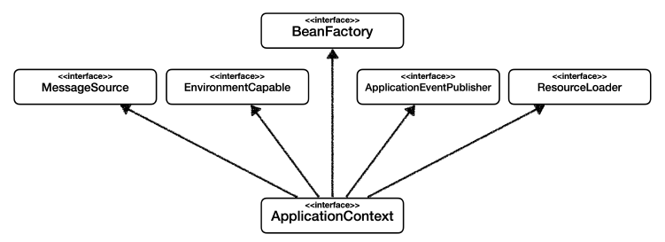

# Spring DI/IoC는 어떻게 동작하나요?

> **목차**
>
>[🌿 IoC와 DI](#-ioc와-di)
>- IoC (Inversion of Control)
>- DI (Dependency Injection)
>
>[🌿 Spring IoC/DI 동작방식](#-spring-iocdi-동작방식)
>- Spring Container
>
>💡BeanFactory와 ApplicationContext

 <hr/>

### 🌿 IoC와 DI

**IoC (Inversion of Control):**

- 소프트웨어 개발에서 컴포넌트 간의 제어 흐름이 외부로 넘어가는 디자인 원칙
- 기존에는 개발자(구현 객체)가 애플리케이션의 제어 흐름을 직접 제어하였지만,  
  IoC는 프레임워크나 컨테이너가 애플리케이션의 흐름을 제어하는 것.

  → 모듈 간 결합도 낮추고, 유지보수성과 확장성 향상


**DI (Dependency Injection):**

- IoC의 한 형태로써 객체 간의 의존관계을 외부에서 주입하는 디자인 패턴
- 의존관계: 객체가 다른 객체에 의존하여 동작하는 것
    - 정적인 클래스 의존관계  
      애플리케이션을 실행하지 않아도 분석 가능. import 코드
    - 동적인 객체(인스턴스) 의존관계  
      애플리케이션 실행 시점(런타임)에 실제 생성된 객체 인스턴스의 참조가 연결된 의존 관계  
      -> DI는 이러한 의존관계를 외부에서 주입하여 객체 간의 결합도를 낮추는 것이다  
      (정적인 클래스 의존관계를 변경하지 않고, 동적인 객체 의존관계를 쉽게 변경할 수 있음)
- DI 방식
    - 생성자 주입(Constructor Injection)
    - 메서드 주입(Method Injection)
    - 속성 주입(Property Injection)

다시 말해, IoC는 제어의 흐름을 역전시키는 원칙이며,  
DI는 객체 간의 의존관계를 외부에서 주입하여 유연하고 확장 가능한 시스템을 만들기 위한 방법 중 하나. 이를 통해 코드의 유지보수성과 확장성을 높일 수 있음.  
IoC와 DI는 Spring 프레임워크에서의 핵심적인 특징 중 하나로, 객체 지향적인 개발을 위한 기능을 제공함
<br/><br/>

### 🌿 Spring IoC/DI 동작방식

Spring은  **컨테이너(Container)** 에 의해 객체의 생명주기와 의존성이 관리됨.  
개발자가 직접 객체를 생성하고 관리하지 않고, Spring 컨테이너가 객체의 생성과 관리를 담당(IoC).

컨테이너는 설정 파일이나 어노테이션을 통해 객체 간의 의존성을 파악하고,  
필요한 객체를 생성하여 주입함(DI)

**Spring 컨테이너**


<br/>

- **컨테이너 생성**<br/>
  일반적으로 `ApplicationContext` 를 스프링 컨테이너라 한다
  ApplicationContext 인터페이스의 구현체를 사용하여 Spring IoC 컨테이너를 인스턴스화하면,  
  컨테이너는 설정된 구성 메타데이터를 기반으로 빈 객체를 생성하고 초기화함<br/><br/>
    - 구성 메타데이터<br/>
      개발자가 객체를 어떻게 인스턴스화하고 구성하며 조립할지를 Spring 컨테이너에 알려주는 것
        - XML 기반 구성<br/>
        `<bean>` 요소를 사용하여 빈의 클래스, 이름, 스코프 등을 설정
            ```xml
            <bean id="myBean" class="com.example.MyBean" scope="singleton">
                <!-- 다양한 설정 옵션 -->
            </bean> 
            ```
        - 어노테이션 기반(Java 코드) 구성<br/>
          @Configuration, @Bean, @Import, @DependsOn 어노테이션 참조
          ```java
              @Component
              public class MyBean {
                  // 클래스 내용
              }
          ```
      
    1. 스프링 컨테이너 생성<br/>
     구성정보를 지정하여 스프링 컨테이너(ApplicationContext)를 생성
        ```java
         // XML 기반
        new ClassPathXmlApplicationContext("services.xml", "daos.xml");
         
        // Java 기반
         new AnnotationConfigApplicationContext(AppConfig.class);
        ```
    2. 스프링 빈 등록<br/>
       컨테이너는 파라미터로 넘어온 구성정보를 사용하여 스프링 빈을 등록
    3. 스프링 빈 의존관계 설정<br/>
     컨테이너는 구성 정보를 참고하여 의존관계를 주입(DI)

<br/>

- **컨테이너 사용**  
  `T getBean(String name, Class<T> requiredType)`: Bean의 인스턴스를 검색

  ```java  
  // 구성된 인스턴스 검색  
  PetStoreService service = context.getBean("petStore", PetStoreService.class);  
         
  // 구성된 인스턴스 사용  
  List<String> userList = service.getUsernameList(); ```

객체는 **생성자** 인자, **팩토리 메서드**의 인자, 또는 객체 인스턴스가 생성되거나 팩토리 메서드에서 반환된 후에 설정된 **속성**을 통해 의존관계를 정의함. 그런 다음 IoC 컨테이너가 Bean을 생성할 때 이러한 의존관계를 주입.

이를 통해, Spring 코드의 모듈성과 유지보수성을 향상시키고, 객체지향 프로그래밍의 원칙을 지키면서 유연하고 확장 가능한 애플리케이션을 만들 수 있도록 도와줌.  
<br/> <br/>


💡 BeanFactory와 ApplicationContext
- [BeanFactory](https://docs.spring.io/spring-framework/docs/current/javadoc-api/org/springframework/beans/factory/BeanFactory.html)<br/>
  인터페이스. 어떠한 유형의 객체도 관리할 수 있는 고급 구성 메커니즘을 제공.
- [ApplicationContext](https://docs.spring.io/spring-framework/docs/current/javadoc-api/org/springframework/context/ApplicationContext.html) <br/>
  BeanFactory의 하위 인터페이스  
    
  즉, BeanFactory는 구성 프레임워크와 기본 기능을 제공하며, ApplicationContext는 더 많은 엔터프라이즈급 기능을 추가한 것.
  (ApplicationContext는 BeanFactory의 완전한 상위 집합)  
    - 스프링 AOP 기능과의 더 쉬운 통합
    - 메시지 리소스 처리(for 국제화)
    - 이벤트 게시
    - 응용 프로그램 레이어별 특정 컨텍스트(ex. 웹 애플리케이션의 WebApplicationContext)
    
  Spring의 IoC 컨테이너는 전적으로 ApplicationContext를 사용하는데, BeanFactory API를 통해 ApplicationContext 대신 BeanFactory를 사용하는 것도 가능함. (🔗for what?)
  

<br/><br/>
🔗 Spring Bean이란?

🔗 팩토리 메서드 패턴

### 요약

---

IoC와 DI는 Spring 프레임워크에서의 핵심적인 특징 중 하나로, 객체 지향적인 개발을 위한 기능을 제공합니다.

제어의 역전(IoC)은 프로그램의 제어 흐름을 직접 제어하는 것이 아니라 외부에서 관리하는 것입니다.
의존관계 주입(DI)은 IoC의 한 형태로써 객체 간의 의존관계를 외부에서 주입하여 유연한 시스템을 만들기 위한 방법 중 하나입니다.

Spring은 컨테이너(ApplicationContext)를 통해  객체의 생명주기와 의존성을 관리합니다.
컨테이너는 설정 파일이나 어노테이션을 통해 객체 간의 의존성을 파악하고,  필요한 객체를 생성하여 주입합니다. 이를 통해 애플리케이션의 구성영역과 사용영역을 분리하여 보다 유연하고 확장가능성 있는 시스템을 개발할 수 있습니다.
<br/>

### 참조

---
- [SpringFrameworkDocs] [Container Overview](https://docs.spring.io/spring-framework/reference/core/beans/basics.html)
- 김영한, "스프링 핵심원리-기본편"(inflearn)